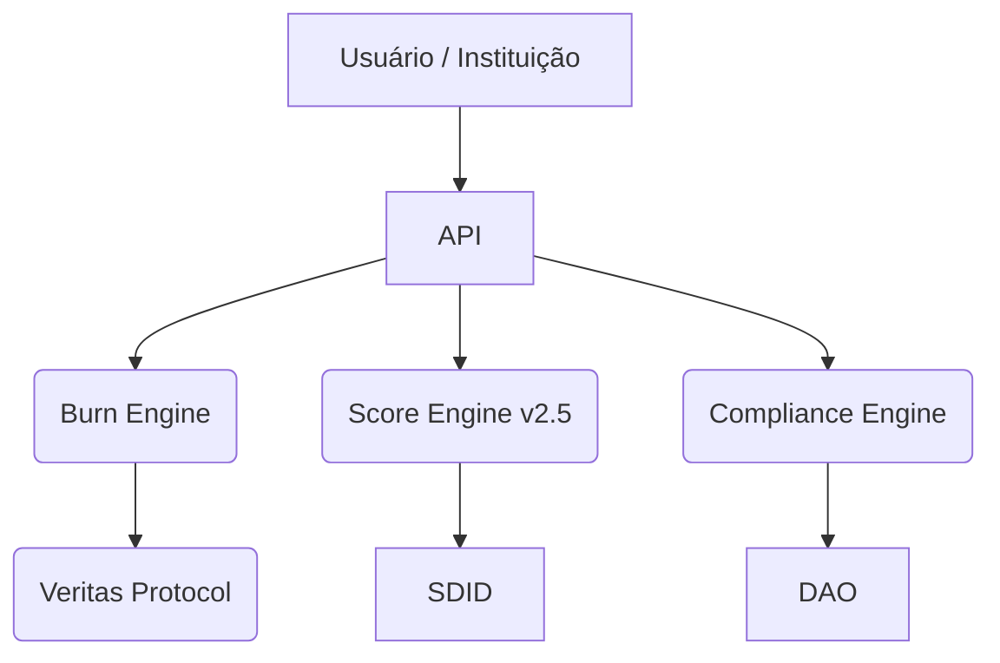

---

Infraestrutura reputacional modular para bancos, fintechs e Web3.  
Automação de score híbrido, flags de risco em tempo real, compliance programável e execução auditável.  
Solução projetada para integração institucional, alta performance e governança de dados.

---

## Sobre a FoundLab

FoundLab é uma camada de confiança programável para instituições financeiras, fintechs e projetos Web3.  
Backbone modular, combinando automação, reputação digital, análise de risco e execução de políticas de compliance, tudo em tempo real, auditável e interoperável.

---

## Arquitetura & Stack

- **Cloud Native:** Google Cloud (Cloud Run, Pub/Sub, BigQuery, Secret Manager, Vertex AI).
- **Módulos Backbone:** +70 módulos (coleta, processamento, análise, score, flags, vigilância, compliance, DevOps/UI, DAO/Open Finance).
- **Core Engines:**  
  - **ScoreLab v2.5:** Scoring híbrido (Spezzatura Engine + Score Sigmoide), integração on-chain e off-chain, ajuste dinâmico de risco.
  - **Burn Engine:** Executor automatizado de políticas de risco.
  - **SDID:** Identidade digital reputacional, tokens interpretáveis, privacidade embutida.
  - **Guardian AI:** Análise antifraude e preditiva.
  - **Veritas Protocol:** Logs imutáveis, rationale auditável.
  - **CoreBank Adapter:** Integração plug-and-play com infra bancária.

---

## Principais Módulos

- **Burn Engine:** Execução automática de flags de risco.
- **ScoreLab Core:** Scoring híbrido TradFi–Web3.
- **Guardian AI:** Detecção antifraude, análise preditiva.
- **SDID:** Identidade digital, tokens simbólicos, privacidade.
- **Veritas Protocol:** Logging imutável e rationale justificado.
- **CoreBank Adapter:** Integração bancária em nível infra.

---

## Como Integrar

- **API REST:** Endpoints em `/api/v1`, documentação OpenAPI (disponível sob NDA).
- **SDKs:** Python, Node.js, Go (beta fechado).
- **Onboarding:** Institucional, OAuth2, integração modular.
- **Ambiente Demo:** Solicite convite via [contact@foundlab.cloud](mailto:contact@foundlab.cloud)

---

## Segurança, Compliance & Licença

- **Compliance:** LGPD, AI Act, MiCA, CVM, BACEN.
- **Logs:** Execução auditável, retenção ≥12 meses.
- **Privacidade:** Dados criptografados e anonimizados.
- **Licença:** Proprietária, uso institucional, NDA obrigatório.

---

## Parcerias & Badges

  
  

---

## Contato

- **Site:** [https://foundlab.cloud](https://foundlab.cloud)
- **Email:** [contact@foundlab.cloud](mailto:contact@foundlab.cloud)
- **LinkedIn:** [https://linkedin.com/company/foundlabcloud](https://linkedin.com/company/foundlabcloud)

---

> _FoundLab powered by Google Cloud_
